# (C# 코딩) SImpleCalculator
## 개요
- C# 프로그래밍학습
- 1줄소개: 사칙연산이 가능한 간단한 계산기 프로그램
-사용한플랫폼: 
  - C#, .NET Windows Forms, Visual Studio, GitHub
- 사용한컨트롤:
  - Label, TextBox, ListBox, Button
- 사용한 기술과 구현한 기능:
  - 사칙연산 기능: 덧셈, 뺄셈, 곱셈, 나눗셈
  - C, Ce, del 버튼 기능: C는 모든 입력 초기화, Ce는 마지막 입력 초기화, del은 마지막 문자 삭제
  - 계산 기록 기능: 계산 결과를 ListBox에 기록하여 이전 계산 내역 확인 가능, 삭제 버튼으로 기록 삭제 가능
  - 예외 처리: 나눗셈에서 0으로 나누는 경우 예외 처리하여 오류 메시지 표시
  - 제곱 기능: X^2 버튼을 추가하여 입력된 숫자의 제곱 계산 가능
  - 부호 변환 기능: +/- 버튼을 추가하여 입력된 숫자의 부호를 양수에서 음수로, 또는 음수에서 양수로 변환 가능
  - . 버튼 기능: 소수점 입력 가능하도록 구현

## 실행 화면 (과제1)
- 과제1 코드의 실행 스크린샷

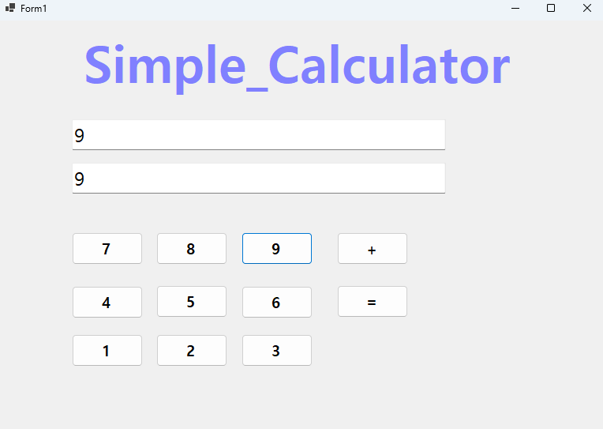
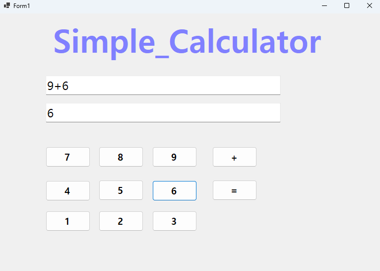
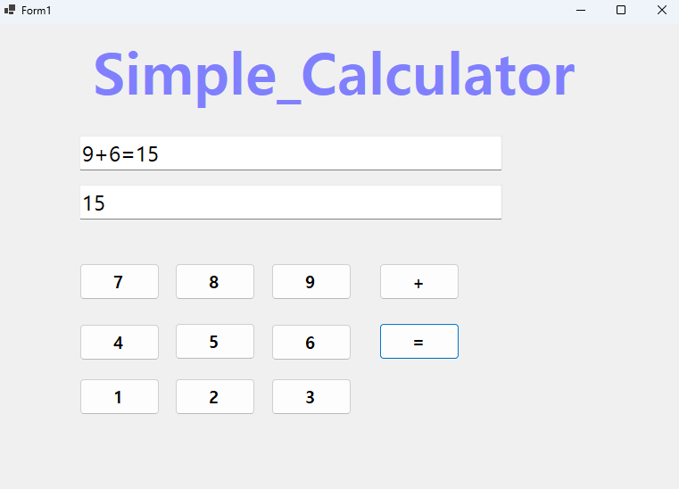

- 과제 내용
  - TextBox(입력표시, 결과표시), Button(계산) 등을 적절히 배치합니다.
  - 숫자 Button 클릭 시TextBox에 표시합니다.
  - 2개의 피연산자의 입력값을Int로 바꾸어 더하기 계산을 수행하고 그 결과를 저장합니다.
  - 계산 결과 값을 문자열로 변환하여 표시합니다.

- 구현 내용과 기능 설명
  - textBox를 이용하여 계산식과 결과를 표시
  - 숫자 버튼을 클릭하면 해당 숫자가 textBox에 표시
  - 연산자 버튼을 클릭하면 계산식에 연산자가 추가되고, 피연산자와 연산자를 저장
  - = 버튼을 클릭하면 저장된 피연산자와 연산자를 이용하여 계산을 하고 결과를 결과값에 표시

## 실행 화면 (과제2)
- 과제2 코드의 실행 스크린샷

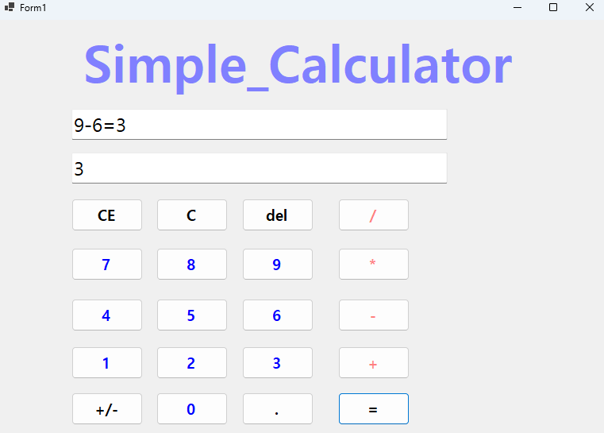
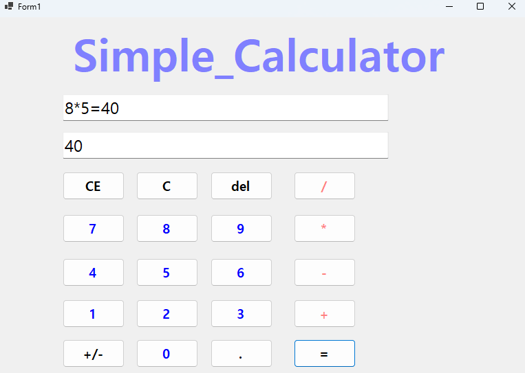

- 과제 내용
  - 뺄셈(-), 곱셈(*), 나눗셈(/) 버튼 추가
  - 각 버튼 클릭 시 연산자만 변경하여 동일 로직 적용

- 구현 내용과 기능 설명
  - 뺄셈, 곱셈, 나눗셈 버튼을 추가하여 다양한 연산 가능
  - 각 연산자 버튼 클릭 시 해당 연산자로 계산식이 업데이트되고, 피연산자와 연산자가 저장
  - operBtn_Click 이벤트 하나로 클릭된 연산자 버튼에 따라 계산 로직 적용

## 실행 화면 (과제3)
- 과제3 코드의 실행 스크린샷

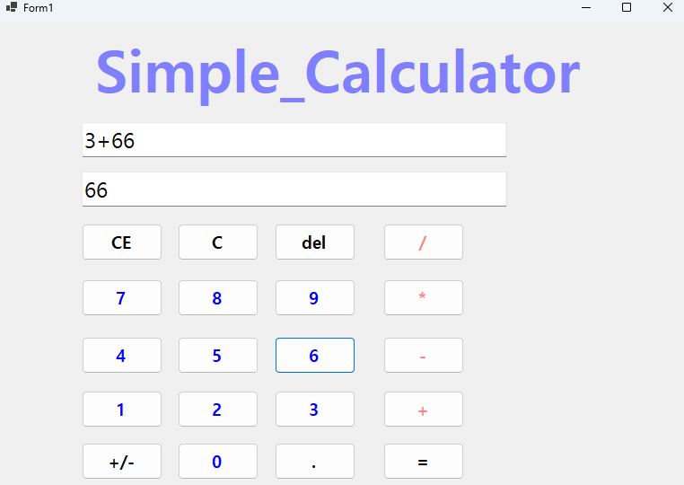
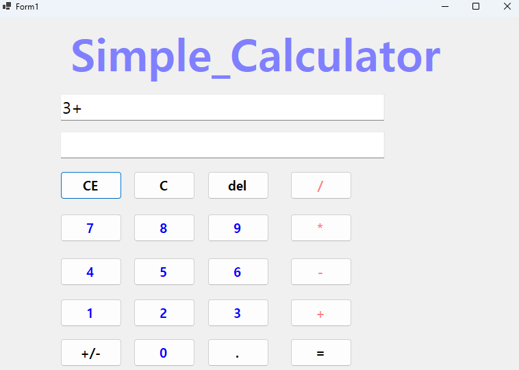
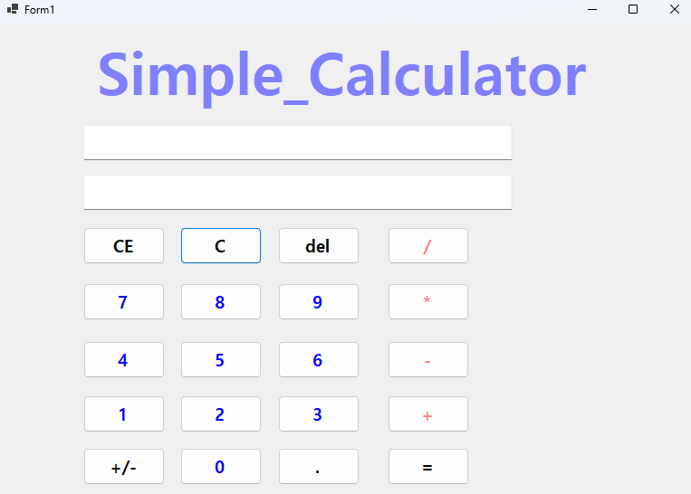

- 과제 내용
  - C 버튼: 현재의 모든 내용을 삭제하고 처음(초기화된) 상태로 되돌아감
  - CE 버튼: 마지막 입력한 피연산자(Operand) 값을 삭제함
  - del 버튼: 마지막 입력된 글자 하나(숫자 하나) 값을 삭제함

- 구현 내용과 기능 설명
  - C 버튼을 클릭하면 계산식과 결과가 모두 초기화되어 처음 상태로 돌아감
  - CE 버튼을 클릭하면 마지막으로 입력된 피연산자 값이 삭제되어 계산식,결과값 수정
  - del 버튼을 클릭하면 계산식에서 마지막으로 입력된 글자 하나가 삭제되어 계산식,결과값 수정
	

## 실행 화면 (과제4)
- 과제4 코드의 실행 스크린샷

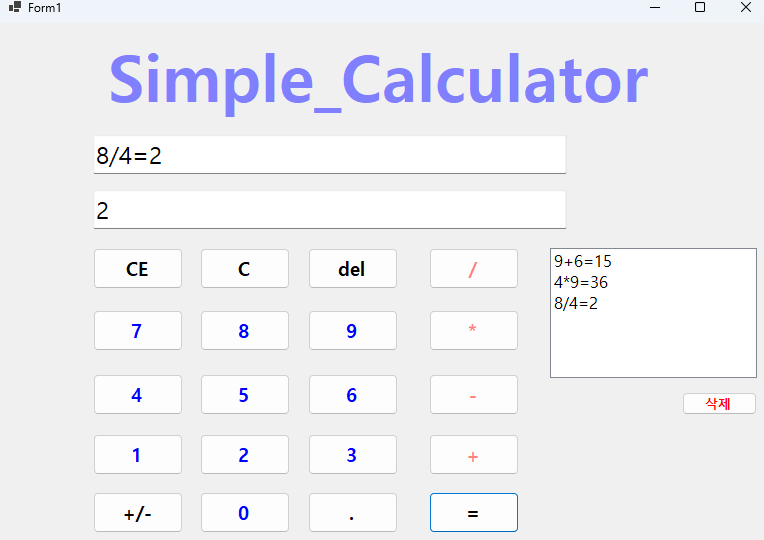
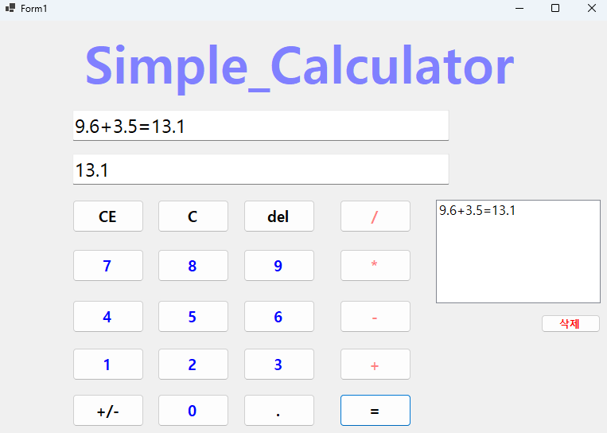
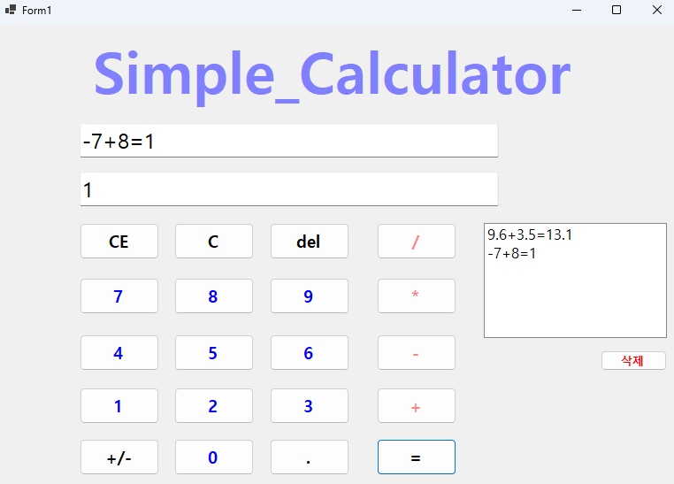
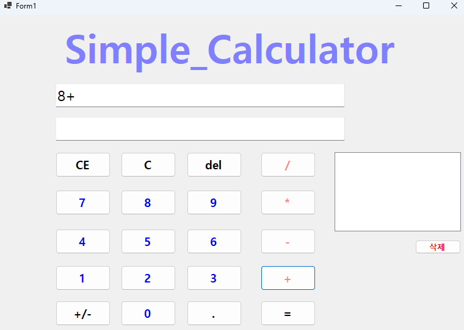
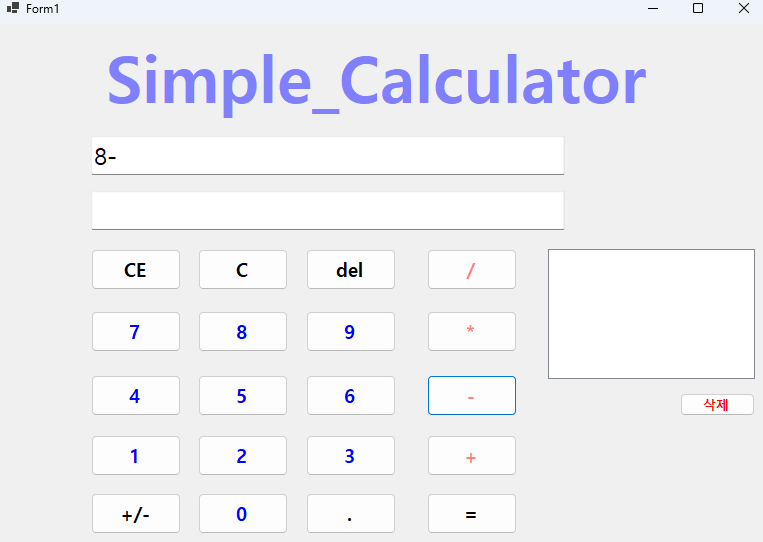
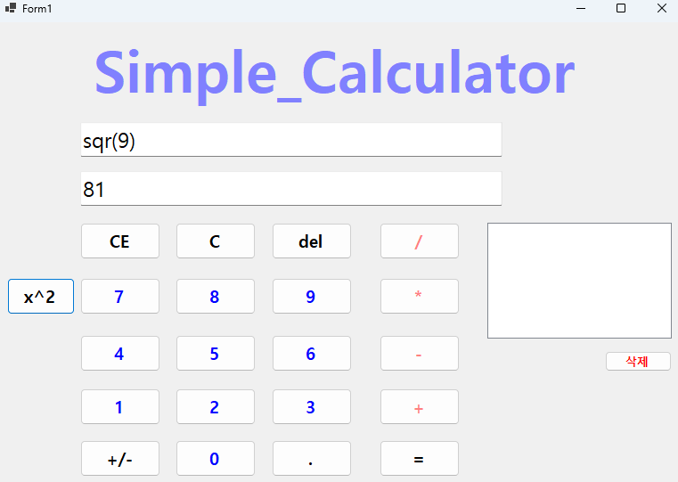
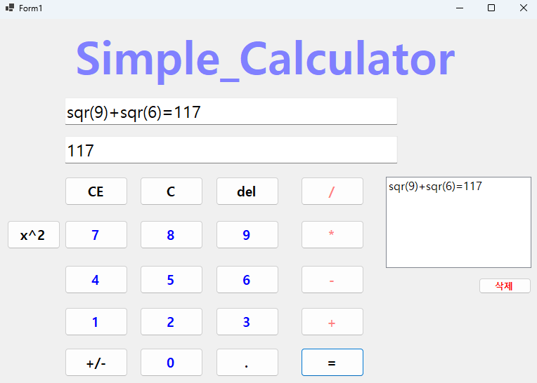

- 과제 내용
  - Windows의 계산기를 참고해서 그 정도 수준으로 만들기

- 구현 내용과 기능 설명
  - 계산 기록 기능: 계산 결과를 ListBox에 기록하여 이전 계산 내역 확인 가능, 삭제 버튼으로 기록 삭제 가능
  - 예외 처리: 나눗셈에서 0으로 나누는 경우 예외 처리하여 오류 메시지 표시
  - 제곱 기능: X^2 버튼을 추가하여 입력된 숫자의 제곱 계산 가능
  - 부호 변환 기능: +/- 버튼을 추가하여 입력된 숫자의 부호를 양수에서 음수로, 또는 음수에서 양수로 변환 가능
  - . 버튼 기능: 소수점 입력 가능하도록 구현